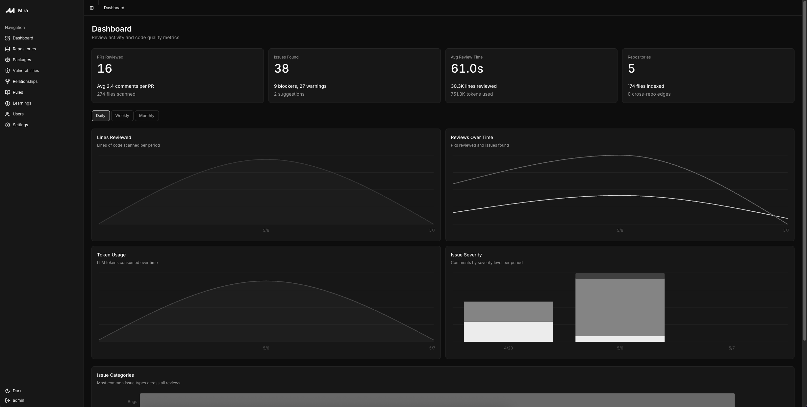

<p align="center">
  
</p>

<h1 align="center">Mira</h1>

<p align="center">
  <strong>The open-source AI code reviewer that's actually open.</strong>
</p>

Self-host every feature — full review engine, codebase indexing, vulnerability scanning, custom rules, org-wide package search, dashboard, learning loop. No paid tier, no license key, no SaaS upsell.

Mira reviews your pull requests using your choice of LLM (via [OpenRouter](https://openrouter.ai), which fronts Anthropic, OpenAI, Google, DeepSeek, and more) and posts concise, actionable feedback. The noise filter, confidence clamping, and learning loop ensure you only see comments that matter. See [`FEATURES.md`](FEATURES.md) for the full surface.

## Dashboard



## Your data, your dashboard

Most AI reviewers are SaaS — your diffs (and often the full surrounding code) leave for a third-party server, and the only "view" you get is the comments that come back on a PR. Mira flips both halves of that:

- **Your code never leaves your infra.** Diffs, embeddings, indexes, review history, vulnerability data — all stored in your SQLite or Postgres, on infrastructure you own. No phone-home, no required telemetry, no "is this used for training?" question.
- **The dashboard you see above is yours.** It's not a marketing screenshot of someone else's view of your code. CodeRabbit, Greptile, and similar SaaS reviewers don't expose anything like it — Mira's dashboard surfaces signals you don't get anywhere else:
  - **Org-wide package inventory** — answer "which repos use `lodash@4.17.20`?" in one query. Stack it next to your CVE feed for instant blast-radius checks.
  - **CVE alerts on every dependency** — hourly OSV.dev poll, severity + advisory link + fix version surfaced inline next to the package.
  - **Dependency + blast-radius graphs** — see exactly which files and repos depend on a symbol before you change it.
  - **Per-repo review event stream** — every webhook, every chunk, every cost figure, in one place for live troubleshooting.
  - **Cost & token telemetry** — actual spend per repo and per model, not estimates, because you control the LLM key.
  - **Coming soon: change-frequency heatmaps** — surface the files that bug fixes keep landing on so you can target review attention.

If your engineering team needs answers like *"which of our repos are exposed to this CVE?"* or *"what's the blast radius of changing this function?"*, those questions stop being multi-day investigations and start being one-click dashboard pages.

## Highlights

- **Any provider via OpenRouter**: Anthropic, OpenAI, Google Gemini, DeepSeek, and more — pay your provider directly, no Mira markup
- **Direct provider + self-hosted model adapters coming**: Anthropic, OpenAI, Google Vertex, Ollama, and vLLM as native backends — useful when you already have provider keys, run open-weights locally, or have data-residency rules that rule out OpenRouter
- **Low noise**: Confidence thresholds, dedupe, severity sorting, per-PR comment caps
- **Indexed reviews**: full-repo code index gives the LLM real context, not just the diff
- **Learns your team**: synthesizes rules from rejected comments and human review patterns on merged PRs
- **Vulnerability scanning**: hourly OSV.dev poll surfaces CVEs across every package in every repo
- **Org-wide package search**: answer "which repos use `lodash@4.17.20`?" in seconds
- **Configurable**: `.mira.yml` for per-repo settings, custom + global rules in the dashboard
- **Self-host on day one**: Docker image, Railway / Fly.io / Render configs, SQLite or Postgres
- **GitHub today, more platforms coming**: GitLab, Bitbucket, and Gitea support are on the roadmap — same review engine, same dashboard, just a different provider adapter

## Quick Start

### GitHub App (self-hosted)

Run Mira as a GitHub App that auto-reviews every PR and responds to comments.

> **Note:** GitHub is the only supported provider today. **GitLab, Bitbucket, and Gitea adapters are on the roadmap** — the review engine, indexer, and dashboard are provider-agnostic; only the webhook + comment-posting layer is GitHub-specific. Star the repo to follow along.

**1. Create a GitHub App** at [github.com/settings/apps/new](https://github.com/settings/apps/new):
- Webhook URL: `https://your-server.com/github/webhook`
- Permissions: Pull Requests (read+write), Contents (read), Issues (read+write)
- Events: Pull requests, Issue comments
- Generate a private key (.pem)

**2. Deploy:**

[](https://railway.com/workspace/templates/05874bad-2d98-43f4-aa93-332f394e9ebd)

Or with Docker:

```bash
docker run -p 8000:8000 \
  -e MIRA_GITHUB_APP_ID=123456 \
  -e MIRA_GITHUB_PRIVATE_KEY="$(cat private-key.pem)" \
  -e MIRA_WEBHOOK_SECRET=your-secret \
  -e MIRA_MODEL=anthropic/claude-sonnet-4-6 \
  -e OPENROUTER_API_KEY=sk-or-... \
  ghcr.io/miracodeai/mira:latest
```

Mira talks to OpenRouter under the hood, so any model OpenRouter supports works. The `MIRA_MODEL` value is whatever the [OpenRouter Models page](https://openrouter.ai/models) lists — examples:

| Provider | `MIRA_MODEL` |
|----------|--------------|
| Anthropic | `anthropic/claude-sonnet-4-6` |
| Anthropic (cheap, indexing) | `anthropic/claude-haiku-4-5` |
| OpenAI | `openai/gpt-4o` |
| OpenAI (cheap) | `openai/gpt-4o-mini` |
| Google | `google/gemini-2.5-pro` |

Set `OPENROUTER_API_KEY` once; one key works across every provider. See [`src/mira/llm/models.json`](src/mira/llm/models.json) for the full registry of models Mira recognises (with pricing and per-purpose recommendations).

> **Coming soon:** direct adapters for **Anthropic**, **OpenAI**, **Google Vertex**, **Ollama**, and **vLLM** — for teams that already hold provider keys, run open-weights models in-house, or have data-residency rules that prevent traffic from flowing through OpenRouter.

**3. Install the app** on your repos — every PR gets auto-reviewed.

**Chat with Mira:** Comment `@mira-bot <question>` on any PR to ask about the code.

## Configuration

Create a `.mira.yml` in your repo root (see [`.mira.yml.example`](.mira.yml.example)):

```yaml
llm:
  model: "openai/gpt-4o"
  fallback_model: "openai/gpt-4o-mini"

filter:
  confidence_threshold: 0.7
  max_comments: 5

review:
  context_lines: 3
```

## Development

```bash
git clone https://github.com/mira-reviewer/mira.git
cd mira
pip install -e ".[dev,serve]"

# Run tests
pytest tests/ -v

# Run the regression suite (hits real GitHub + LLM, ~$1, ~3 min).
# Pinned PRs whose findings have flickered across iterations — run before
# merging changes that touch prompts, the noise filter, or the engine.
OPENROUTER_API_KEY=... GITHUB_TOKEN=... pytest -m eval -v

# Lint
ruff check src/ tests/

# Type check
mypy src/mira/ --ignore-missing-imports
```

## License

Apache 2.0 — see [LICENSE](LICENSE).
